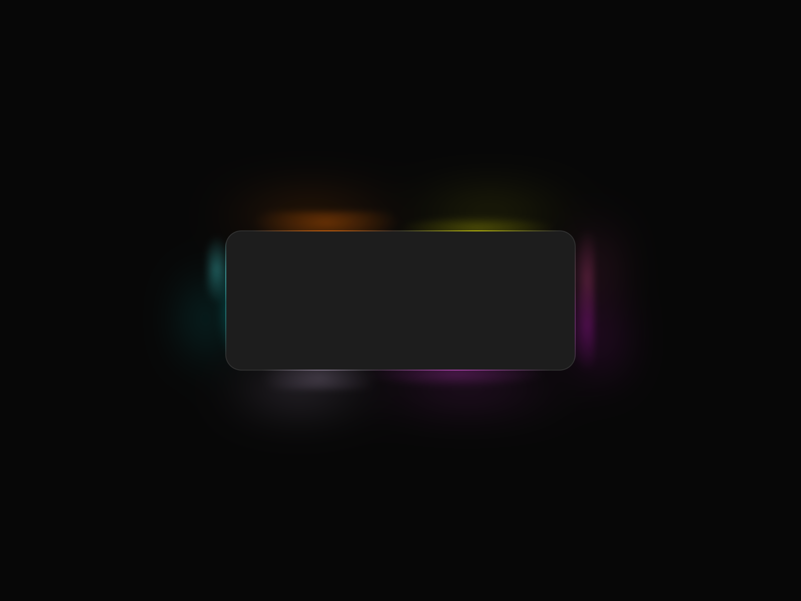
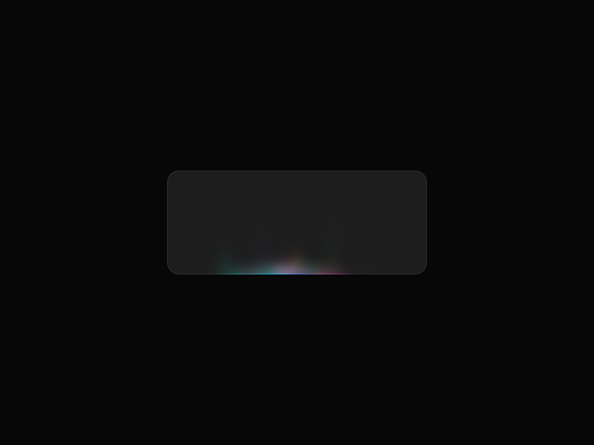
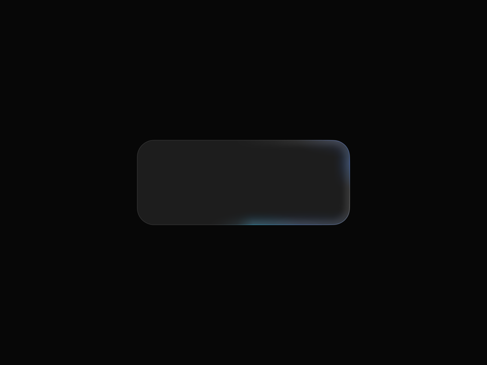

# border_beam

Animated border beam effects for Flutter — a traveling or breathing glow around any widget: cards, buttons, inputs, or search bars.

A faithful Flutter port of the [border-beam](https://github.com/Jakubantalik/border-beam) React library by [Jakub Antalik](https://x.com/jakubantalik) ([live demo](https://beam.jakubantalik.com)). Every palette, gradient, mask, blur, and timing curve is transcribed from the original source, so the effects are pixel-matched — with Flutter-native additions on top: superellipse (squircle) borders, custom color palettes, a playback controller, and spring-eased fades.

## Showcase

<table>
  <tr>
    <td width="50%" align="center">
      <br/>
      <sub><b>Rotate</b> — a beam travels around the border</sub>
    </td>
    <td width="50%" align="center">
      <br/>
      <sub><b>Pulse outside</b> — a breathing halo blooms behind the child</sub>
    </td>
  </tr>
  <tr>
    <td width="50%" align="center">
      <br/>
      <sub><b>Line</b> — the beam rides the bottom edge</sub>
    </td>
    <td width="50%" align="center">
      <br/>
      <sub><b>Superellipse</b> — Apple-style squircle borders, <code>ocean</code> palette</sub>
    </td>
  </tr>
</table>

Run the example app for the full animated gallery (`cd example && flutter run`); demo videos are recorded with `tool/record_demo.sh` (see [Recording demos](#recording-demos)).

## Highlights

- **Five variants**, each a named constructor with tuned defaults: `rotate`, `small`, `line`, `pulseInside`, `pulseOutside`.
- **Four palettes** from the original (`colorful`, `mono`, `ocean`, `sunset`), plus `BeamColors.custom(...)` for your own colors and `BeamColors.spec(...)` for per-blob control.
- **Superellipse borders** — one flag switches the beam to an Apple-style squircle.
- **Playback control** — declarative `active` toggling with spring-eased fades, `autoPlay`/`startAfter`/`duration` scheduling, or a full `BorderBeamController`.
- **Dark & light themes** per variant, following your app theme automatically.
- **Decorative-only** — beam layers never intercept pointers; your child lays out and hit-tests normally.
- **Performance-minded** — one `Ticker` per beam, ~30fps cap for pulse variants, `RepaintBoundary`-isolated painting (your child never re-rasterizes), CPU-folded color filters (≤3 `saveLayer`s per frame).
- **Accessible** — honors `MediaQuery.disableAnimations` out of the box.

## Requirements

- Flutter ≥ 3.35 (stable `RoundedSuperellipseBorder` / `RSuperellipse`)
- Dart ≥ 3.9

## Install

```yaml
dependencies:
  border_beam: ^0.1.0
```

## Usage

Wrap any widget:

```dart
import 'package:border_beam/border_beam.dart';

BorderBeam.rotate(
  child: Card(child: content),
)
```

### Variants

```dart
BorderBeam.rotate(child: card)        // full border beam — cards, surfaces
BorderBeam.small(child: iconButton)   // compact — buttons, chips (32px radius)
BorderBeam.line(child: searchBar)     // travels the bottom edge — inputs
BorderBeam.pulseInside(child: card)   // contained breathing glow
BorderBeam.pulseOutside(child: card)  // halo blooming outward behind the child
```

> **pulse-outside contract** (same as the original): the child must be opaque
> so only the outward spill shows, should have its own 1px border for a
> defined idle edge, and needs clip-free room around it — padding in the
> parent, no tight `ClipRRect`.

### Colors

```dart
// Presets
BorderBeam.rotate(colors: BeamColors.ocean, child: card)   // also: colorful (default), mono, sunset

// Your own colors, distributed over the preset blob geometry
BorderBeam.rotate(
  colors: BeamColors.custom([Colors.pink, Colors.cyan, Colors.amber]),
  child: card,
)

// Advanced: position every blob yourself
BorderBeam.rotate(
  colors: BeamColors.spec(border: [
    BeamBlob(color: Colors.pink, position: Offset(0.3, 0), size: Size(70, 40)),
    // ...
  ]),
  child: card,
)
```

`mono` disables the hue animation and halves layer opacity, exactly like the source.

### Shape

```dart
BorderBeam.rotate(
  borderRadius: 24,          // match your child's decoration radius
  useSuperellipse: true,     // Apple-style squircle contour
  child: card,
)
```

`borderRadius` defaults to the variant preset (16, or 32 for `small`). There is no auto-detection of the child's radius — pass the same value your child uses.

### Scheduling (no controller)

```dart
BorderBeam.pulseInside(
  active: isLoading,                        // fades in 0.6s / out 0.5s (spring-eased)
  startAfter: Duration(milliseconds: 500),  // delay before autoplay
  duration: Duration(seconds: 10),          // total play time; null = loop forever
  onActivate: () => print('visible'),       // fires when the fade-in completes
  onDeactivate: () => print('hidden'),
  child: card,
)
```

### Controller

Attach a `BorderBeamController` for programmatic playback. The controller takes **full ownership** — `startAfter`/`duration` must not be set, and the beam starts hidden until you `start()`:

```dart
final controller = BorderBeamController();

BorderBeam.rotate(controller: controller, child: card);

controller.start();     // fade in, play
controller.pause();     // freeze the current frame
controller.resume();
controller.speed = 2;   // playback rate
controller.seek(Duration(seconds: 1));
controller.stop();      // fade out, halt
```

### Fine tuning

Every tuning hook of the original is a parameter:

| Parameter | Default | Purpose |
|---|---|---|
| `strength` | `1.0` | Overall effect opacity (0–1); only affects beam layers |
| `cycleDuration` | 1.96s / 3.1s / 2.3s | One animation cycle (rotate·small / line / pulse) |
| `theme` | `BeamTheme.auto` | `dark`, `light`, or follow `Theme.of(context)` |
| `brightness`, `saturation` | per variant/theme | Glow filter multipliers |
| `hueRange` | `30` (line caps at 13) | Hue animation amplitude in degrees |
| `hueBase` | `0` | Static hue offset for the whole palette |
| `staticColors` | `false` | Disable the hue animation |
| `respectReducedMotion` | `true` | Static frame under `MediaQuery.disableAnimations` |
| `strokeOpacityFactor`, `innerOpacityFactor`, `bloomOpacityFactor` | `1` | Per-layer opacity multipliers |
| `glowBoost` (pulse) | `1` | Halo prominence |
| `coreBlur`, `bloomBlur`, `glowBrightness`, `glowSaturation` (pulse-outside) | preset | Glow tuning overrides |

## Example app

`example/` contains a full gallery recreating the original demo — Rotate/Pulse example tabs with mock chat inputs, task cards, and search bars, plus an interactive playground with live code snippets:

```bash
cd example && flutter run
```

## Recording demos

Demo reels live in `example/lib/*.dart` and use the marker-based harness in `example/lib/demo_harness.dart`. Record on a booted iOS simulator (requires `ffmpeg`):

```bash
tool/record_demo.sh --target lib/showcase.dart --prefix SHOWCASE --contact
```

Outputs land in `.demos/` (gitignored) as 60fps center-cropped mp4s with a contact sheet for review.

## Credits & attribution

This package is a port of **[border-beam](https://github.com/Jakubantalik/border-beam)** — created and designed by **[Jakub Antalik](https://x.com/jakubantalik)** and released under the MIT license. All visual design — the five effects, color palettes, gradient geometry, animation timings, and the demo it ships with — is his work. If you like the effect, go star the original.

The Flutter port adds the widget/controller architecture, superellipse shapes, custom palette API, and the canvas rendering engine.

## License

[MIT](LICENSE) — includes the original work's copyright notice.
