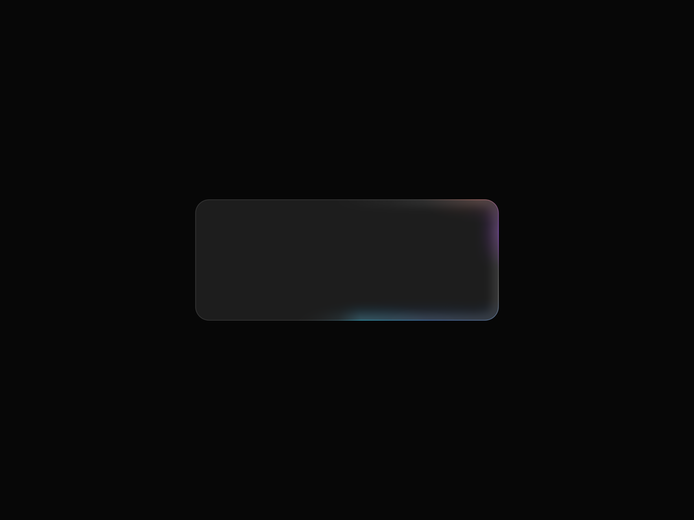

# flutter_border_beam

**Animated border beams for Flutter** — a traveling or breathing glow around any widget: cards, buttons, inputs, search bars.

[](https://pub.dev/packages/flutter_border_beam)
[](https://pub.dev/packages/flutter_border_beam/score)
[](https://github.com/SimplifyJobs/flutter_border_beam/actions/workflows/ci.yaml)
[](https://codecov.io/gh/SimplifyJobs/flutter_border_beam)
[](LICENSE)

A faithful Flutter port of the [border-beam](https://github.com/Jakubantalik/Libraries/tree/main/packages/border-beam) React library by [Jakub Antalik](https://x.com/jakubantalik) ([live demo](https://beam.jakubantalik.com)). Every palette, gradient, mask, blur, and timing constant is transcribed from the original source, so the effects are pixel-matched — with Flutter-native additions on top. It tracks upstream **border-beam 1.4.0**; see [Parity with the original](#parity-with-the-original).

## Showcase


<table>
  <tr>
    <td width="50%" align="center">
      <br/>
      <sub><b>Rotate</b> — a beam travels around the border</sub>
    </td>
    <td width="50%" align="center">
      <br/>
      <sub><b>Pulse outside</b> — a breathing halo blooms behind the child</sub>
    </td>
  </tr>
  <tr>
    <td width="50%" align="center">
      <br/>
      <sub><b>Line</b> — the beam rides the bottom edge</sub>
    </td>
    <td width="50%" align="center">
      <br/>
      <sub><b>Superellipse</b> — Apple-style squircle borders, <code>ocean</code> palette</sub>
    </td>
  </tr>
</table>

### Live playground

**<https://simplifyjobs.github.io/flutter_border_beam/>** — every variant, palette, and tuning hook on live controls, with the matching Dart snippet and a shareable link. Deployed from [`example/`](example).

## Highlights

- **Five variants** — `rotate`, `small`, `line`, `pulseInside`, `pulseOutside`, each a named constructor with tuned defaults, plus a generic `BorderBeam(variant: …)` for a runtime choice.
- **Eleven palettes** — the four from the original plus seven Flutter-only ones, with `BeamColors.custom`, `fromSeed` harmonies, `fromScheme`, `lerp`, `scaleAlpha`, and per-blob `spec`.
- **Value-object API** — `BeamStyle`, `BeamShape`, `BeamTiming`, `BeamPlayback`; every field nullable, so anything you leave out is inherited. App-wide defaults live in a `BorderBeamTheme`, and nested themes merge.
- **Shapes** — per-corner direction-aware radii, stadium, Apple-style superellipse, ring offset, and arbitrary path contours.
- **Motion** — cycle gap, direction (forward / reverse / bounce), phase offset, several beams on one contour, driven `progress`, pointer `follow`.
- **`BeamSync`** — one ticker and one timeline for a whole subtree, so a row of cards reads as one system.
- **Surfaces & interactions** — `BorderBeam.overlay`, a `BeamDecoration` for existing `Container`s, and `BeamFocusRing` / `BeamHover` / `BeamPress` wrappers.
- **Controller** — `start` / `stop` / `pause` / `resume` / `seek` / `speed`, plus one-shot `pulse()` and `flash()` accents.
- **Accessible** — four documented reduced-motion behaviors, and beams are purely decorative: they add no semantics and never intercept a pointer.
- **Fast** — one ticker per beam (or per `BeamSync`), a ~30fps cap on the pulse variants, `RepaintBoundary` isolation so the child never re-rasterizes, CPU-folded color matrices, an offscreen pause, and a `saveLayer` budget pinned by a test.

## Requirements

| | |
| --- | --- |
| Flutter | ≥ 3.35 (stable `RoundedSuperellipseBorder` / `RSuperellipse`) |
| Dart | ≥ 3.9 |
| Dependencies | none beyond the Flutter SDK |

## Install

```console
flutter pub add flutter_border_beam
```

## Quick start

```dart
import 'package:flutter/material.dart';
import 'package:flutter_border_beam/flutter_border_beam.dart';

BorderBeam.rotate(
  borderRadius: 16,
  colors: BeamColors.ocean,
  child: Card(
    shape: RoundedRectangleBorder(borderRadius: BorderRadius.circular(16)),
    child: const Padding(
      padding: EdgeInsets.all(24),
      child: Text('Working on it…'),
    ),
  ),
)
```

That is the whole API for the common case. Everything else is a field on one of four value objects — `style`, `shape`, `timing`, `playback` — and every one of their fields is nullable, meaning *inherit*.

```dart
BorderBeam(
  variant: BeamVariant.line,
  style: const BeamStyle(colors: BeamColors.sunset, strength: 0.8),
  shape: const BeamShape.all(24, superellipse: true),
  timing: const BeamTiming(cycleGap: Duration(seconds: 1)),
  playback: const BeamPlayback(reducedMotion: BeamReducedMotion.staticFrame),
  child: card,
)
```

Guides for each area live in [`doc/`](doc): [variants](doc/variants.md) · [palettes](doc/palettes.md) · [shape](doc/shape.md) · [motion](doc/motion.md) · [theming](doc/theming.md) · [performance](doc/performance.md) · [accessibility](doc/accessibility.md) · [parity](doc/parity.md) · [architecture](doc/architecture.md).

## Variants

```dart
BorderBeam.rotate(child: card);        // full border beam — cards, surfaces
BorderBeam.small(child: iconButton);   // compact — buttons, chips (32px radius)
BorderBeam.line(child: searchBar);     // travels one edge — inputs
BorderBeam.pulseInside(child: card);   // contained breathing glow
BorderBeam.pulseOutside(child: card);  // halo blooming outward behind the child

// Picked at runtime — same parameters, no switch:
BorderBeam(variant: variant, child: card);
```

| Variant | Upstream name | Family | Default cycle | Default radius | Default hue track | Paints |
| --- | --- | --- | --- | --- | --- | --- |
| `rotate` | `md` | traveling | 1.96s | 16 | ping-pong, 12s | over the child |
| `small` | `sm` | traveling | 1.96s | 32 | ping-pong, 12s | over the child |
| `line` | `line` | traveling | 3.1s | 16 | ping-pong, 12s (bloom 8s) | over the child |
| `pulseInside` | `pulse-inner` | pulse | 2.3s | 16 | continuous, 16s | over the child |
| `pulseOutside` | `pulse-outside` | pulse | 2.3s | 16 | continuous, 14s | behind and outside the child |

The two families differ in more than looks: the traveling variants sweep a window around the contour and respond to `direction`, `cycleGap`, `beamCount`, `progress`, and `follow`; the pulse variants breathe from a bank of oscillators and ignore all of those. Details per variant: **[doc/variants.md](doc/variants.md)**.

> ⚠️ **pulse-outside contract** (the same one the original states): the child must be **opaque**, so only the outward spill shows; it should carry its **own 1px border** for a defined idle edge; and it needs **clip-free room** around it — padding in the parent, no tight `ClipRRect`. A halo with nowhere to bloom is a halo you cannot see.

## Palettes

```dart
// Presets
BorderBeam.rotate(colors: BeamColors.ocean, child: card);

// Your own colors, distributed over the preset blob geometry
BorderBeam.rotate(
  colors: const BeamColors.custom([Colors.pink, Colors.cyan, Colors.amber]),
  child: card,
);

// One brand color, spread into a harmony
BorderBeam.rotate(
  colors: const BeamColors.fromSeed(
    Color(0xFF18A8F0),
    harmony: BeamSeedHarmony.triadic,
  ),
  child: card,
);

// The app's Material scheme
BorderBeam.rotate(
  colors: BeamColors.fromScheme(Theme.of(context).colorScheme),
  child: card,
);

// Blend two palettes, and dim one
BorderBeam.rotate(
  colors: const BeamColors.lerp(BeamColors.ocean, BeamColors.sunset, 0.35),
  child: card,
);
BorderBeam.rotate(colors: BeamColors.ember.scaleAlpha(0.6), child: card);

// Advanced: position every blob yourself
BorderBeam.rotate(
  colors: const BeamColors.spec(
    border: [
      BeamBlob(
        color: Color(0xFFFF4D8D),
        position: Offset(0.33, -0.074),
        size: Size(70, 40),
      ),
    ],
  ),
  child: card,
);
```

| Preset | Origin | Colors | Notes |
| --- | --- | --- | --- |
| `colorful` | upstream | rainbow spectrum | the default |
| `mono` | upstream | grayscale | pins the hue and halves layer opacity |
| `ocean` | upstream | blue, purple | |
| `sunset` | upstream | orange, yellow, red | |
| `aurora` | Flutter-only | teal, violet, green, glacier blue | |
| `neon` | Flutter-only | magenta, cyan, lime | the loudest |
| `candy` | Flutter-only | pink, lavender, peach | pastel |
| `ember` | Flutter-only | deep red, orange, gold | |
| `ice` | Flutter-only | pale blue, white, cyan | |
| `gold` | Flutter-only | amber, gold, bronze | pins the hue, keeps full opacity |
| `holographic` | Flutter-only | desaturated pastels | built to be paired with a fast continuous hue drift |

| Constructor / transform | Signature | What it does |
| --- | --- | --- |
| `BeamColors.custom` | `custom(List<Color> colors, {BeamColors base = BeamColors.colorful})` | Distributes your colors over `base`'s blob geometry, cycling when there are fewer colors than slots and preserving each entry's alpha. The list must not be empty. |
| `BeamColors.fromSeed` | `fromSeed(Color seed, {BeamSeedHarmony harmony = BeamSeedHarmony.analogous})` | Spreads one brand color into `analogous`, `complementary`, `triadic`, or `monochrome`. Derived colors are lifted into a readable glow band (lightness 0.55–0.70, saturation ≥ 0.55), so a black or gray seed still reads. |
| `BeamColors.fromScheme` | `fromScheme(ColorScheme scheme)` | Takes `primary`, `secondary`, `tertiary`, dropping roles that duplicate an earlier one. |
| `BeamColors.lerp` | `lerp(BeamColors a, BeamColors b, double t)` | Table-by-table `Color.lerp`. `t` is not clamped, so it extrapolates. |
| `scaleAlpha` | `scaleAlpha(double factor)` | Multiplies every table entry's alpha, preserving the relative depth of the inner / stroke / bloom layers. `factor` must not be negative. |
| `BeamColors.spec` | `spec({required List<BeamBlob> border, List<BeamBlob>? smallBorder, List<LineBlob>? lineBlobs})` | Full per-blob control. `BeamBlob.size` holds ellipse **radii**, not diameters; omitted tables are derived by cycling the border colors. |

Every `BeamColors` is a value type and resolution is memoized by value, so rebuilding `BeamColors.custom([...])` inline in `build` does not re-resolve the gradient tables. More: **[doc/palettes.md](doc/palettes.md)**.

## Shape

```dart
// Uniform radius, const
BorderBeam.rotate(
  shape: const BeamShape.all(24, superellipse: true),
  child: card,
);

// Per-corner, direction-aware
BorderBeam.rotate(
  shape: const BeamShape(
    radius: BorderRadiusDirectional.only(topStart: Radius.circular(28)),
  ),
  child: card,
);

// A pill (a circle on a square box) that tracks the box as it resizes
BorderBeam.small(shape: const BeamShape.stadium(), child: chip);

// The ring 8px outside the child, with the beam on the top edge
BorderBeam.line(
  shape: const BeamShape.all(16, ringOffset: 8, edge: BeamEdge.top),
  child: card,
);

// An arbitrary contour
BorderBeam.rotate(
  shape: BeamShape(
    contour: BeamPathContour((rect) => Path()..addOval(rect), key: 'oval'),
  ),
  child: card,
);
```

| Field | Type | Default | Applies to |
| --- | --- | --- | --- |
| `radius` | `BorderRadiusGeometry?` | 16 (32 for `small`) | all — ignored when `contour` is set |
| `borderWidth` | `double?` | `1` | all |
| `superellipse` | `bool?` | `false` | all — ignored when `contour` is set |
| `edge` | `BeamEdge?` | `BeamEdge.bottom` | `line` |
| `ringOffset` | `double?` | `0` | all |
| `contour` | `BeamContour?` | none | all |

Three constructors cover the common cases: `BeamShape.all(r)` is the **const** path to a uniform radius (it stores the number rather than building a `BorderRadius`), `BeamShape.circular(r)` is the same shape when you already think in `BorderRadius` terms (**not** const), and `BeamShape.stadium()` rounds each corner to half the shortest side. `radius` resolves against the ambient `Directionality` and clamps per corner the way `RRect.scaleRadii` does.

There is **no auto-detection of the child's radius** — pass the same value your child uses. Full treatment, including writing a `BeamContour`: **[doc/shape.md](doc/shape.md)**.

## Style

```dart
BorderBeam.rotate(
  style: const BeamStyle(
    colors: BeamColors.aurora,
    strength: 0.8,
    comet: true,
    sparkle: 0.4,
    tailLength: 1.4,
  ),
  child: card,
);
```

| Field | Type | Default | Applies to |
| --- | --- | --- | --- |
| `colors` | `BeamColors?` | `BeamColors.colorful` | all |
| `theme` | `BeamTheme?` | `BeamTheme.auto` | all |
| `strength` | `double?` | `1.0` (clamped 0–1) | all |
| `brightness` | `double?` | preset, else `1.3` | all |
| `saturation` | `double?` | preset | all |
| `hueRange` | `double?` | `30` (`line` caps at 13) | all |
| `hueMode` | `BeamHueMode?` | `pingPong` traveling, `continuous` pulse | all |
| `hueBase` | `double?` | `0` | all |
| `staticColors` | `bool?` | `false` (forced on by `mono` and `gold`) | all |
| `strokeOpacityFactor` | `double?` | `1` | all |
| `innerOpacityFactor` | `double?` | `1` | all |
| `bloomOpacityFactor` | `double?` | `1` | all |
| `glowBoost` | `double?` | `1` | `pulseInside`, `pulseOutside` |
| `coreBlur` | `double?` | preset | `pulseOutside` |
| `bloomBlur` | `double?` | preset | `pulseOutside` |
| `glowBrightness` | `double?` | preset | `pulseOutside` |
| `glowSaturation` | `double?` | preset | `pulseOutside` |
| `tailLength` | `double?` | `1` | `rotate`, `small` |
| `glowSpread` | `double?` | `1` | all |
| `comet` | `bool?` | `false` | `rotate`, `small` |
| `sparkle` | `double?` | `0` (clamped 0–1) | `rotate`, `small` |
| `segments` | `int?` | none (solid ring) | `rotate`, `small`, `line` |
| `innerSizeScale` | `double?` | `1` | `pulseInside` |
| `renderScale` | `double?` | `1` (clamped 0.25–1) | all |
| `pulseOutsideTuning` | `BeamPulseOutsideTuning?` | `demo` | `pulseOutside` |
| `themeConfig` | `BeamThemeConfig?` | per variant × brightness | all |

Four of these are worth a sentence each.

**`themeConfig`** replaces the whole variant × brightness preset — layer opacities, inset shadow, and the default brightness/saturation. Start from a preset rather than inventing one:

```dart
BorderBeam.rotate(
  style: BeamStyle(
    themeConfig: BeamThemeConfig.presetFor(
      BeamVariant.rotate,
      Brightness.dark,
    ).copyWith(bloomOpacity: 0.4),
  ),
  child: card,
);
```

**`innerSizeScale`** multiplies the size of `pulseInside`'s inner blobs. Below 1 the wash pulls tighter to the border, leaving more of the child clear; above 1 it floods further in. The perimeter ring and the bloom keep their own geometry, so the border itself does not move.

```dart
BorderBeam.pulseInside(
  style: const BeamStyle(innerSizeScale: 0.7),
  child: card,
);
```

**`renderScale`** is the fraction of the box the beam is *painted* at before being magnified back to fill it (0.25–1). The palettes are authored against a 350×140 card, so on a screen-width box the blobs read as small and sparse; painting at 0.5 and magnifying restores the proportions the palette was drawn for — glow, blurs, and corner radii all grow together. It costs one canvas transform and no extra layer, but it *is* a magnification, so the ring's own edge softens as the factor drops.

```dart
BorderBeam.rotate(
  style: const BeamStyle(renderScale: 0.35),
  child: fullScreenSurface,
);
```

**`BeamStyle.pulseOutsideStock`** is a ready-made style carrying the upstream library's **stock** pulse-outside look — a tighter, dimmer halo sitting closer to the child. `BorderBeam.pulseOutside` paints the tuned demo recipe by default, because that is the look the library is known for; the stock style rolls every part of that tuning back (the prominence boost and glow multiplier through their hooks, and the insets, blurs, and size-derived unit through `pulseOutsideTuning`). Layer your own fields over it with `copyWith` — anything you set wins.

```dart
BorderBeam.pulseOutside(style: BeamStyle.pulseOutsideStock, child: card);
```

`pulseOutsideTuning` on its own switches only the glow geometry: `BeamPulseOutsideTuning.demo` (the default) scales insets and blurs by the element's size, melting the separate blobs into one continuous edge-hugging glow; `.stock` uses the library's fixed insets and per-brightness blur.

## Timing

```dart
BorderBeam.rotate(
  timing: const BeamTiming(
    cycle: Duration(seconds: 3),      // one sweep
    cycleGap: Duration(seconds: 1),   // rest between sweeps
    direction: BeamDirection.bounce,  // alternate each cycle
    beamCount: 3,                     // three beams, equally spaced
    speed: 1.5,                       // playback rate
  ),
  child: card,
);
```

| Field | Type | Default | Applies to |
| --- | --- | --- | --- |
| `cycle` | `Duration?` | 1.96s rotate/small · 3.1s line · 2.3s pulse | all |
| `cycleGap` | `Duration?` | `Duration.zero` | `rotate`, `small`, `line` |
| `speed` | `double?` | `1` (a controller's `speed` wins) | all |
| `direction` | `BeamDirection?` | `forward` | `rotate`, `small`, `line` |
| `phaseOffset` | `double?` | `0` (fraction of a cycle, 0–1) | all |
| `beamCount` | `int?` | `1` | `rotate`, `small`, `line` |
| `huePeriod` | `Duration?` | 12s traveling · 16s pulseInside · 14s pulseOutside | all |
| `bloomHuePeriod` | `Duration?` | 8s | `line` |
| `breatheFactor` | `double?` | `1.3` × `cycle` | `line` |
| `spikeFactor` | `double?` | `1.33` × `cycle` | `line` |
| `spike2Factor` | `double?` | `1.7` × `cycle` | `line` |

Changing `cycle` while the beam runs **retimes it in place** — every track keeps its phase, so the beam speeds up or slows down without a jump. `cycleGap` parks the beam at the end of its travel between sweeps, fading out and back in over `min(0.25s, gap / 2)` at each end; the hue, breathe, and spike tracks are textures rather than the sweep, so they keep running through the gap. More: **[doc/motion.md](doc/motion.md)**.

## Playback

```dart
BorderBeam.pulseInside(
  active: isLoading,                          // fades in 0.6s / out 0.5s
  playback: const BeamPlayback(
    startAfter: Duration(milliseconds: 500),
    duration: Duration(seconds: 10),
    repeat: BeamRepeat.count(3),
    reducedMotion: BeamReducedMotion.staticFrame,
  ),
  onActivate: () => debugPrint('visible'),    // when the fade-in completes
  onDeactivate: () => debugPrint('hidden'),
  child: card,
);
```

| Field | Type | Default | Meaning |
| --- | --- | --- | --- |
| `active` | `bool?` | `true` | Play state. Toggling fades in (0.6s) / out (0.5s). |
| `autoPlay` | `bool?` | `true` | Whether the beam starts by itself. |
| `startAfter` | `Duration?` | none | Delay before autoplay. Must be null with a controller. |
| `duration` | `Duration?` | none (plays on) | Total play time before a self fade-out. Must be null with a controller. |
| `repeat` | `BeamRepeat?` | `BeamRepeat.forever()` | `forever()`, `once()`, or `count(n)` cycles, then a fade-out. |
| `reducedMotion` | `BeamReducedMotion?` | `staticFrame` | What to do when the platform asks for reduced motion. |
| `pauseWhenOffscreen` | `bool?` | `true` | Stops the clock while the beam is scrolled out of its nearest enclosing `Scrollable`, with a 256px margin. |
| `fadeCurve` | `Curve?` | the fade spring | The easing both fade envelopes run on. |
| `debugFrozenAt` | `Duration?` | none | Pins the beam to one instant of its timeline, at full opacity, and never starts its clock. |

`reducedMotion` has four behaviors, all of them applying to all five variants:

| `BeamReducedMotion` | Behavior |
| --- | --- |
| `staticFrame` | Paints a single static frame and stops ticking. **The default.** |
| `hide` | Paints nothing; the child is left bare and no ticker runs. |
| `slow` | Keeps animating at a quarter of the configured speed. |
| `animate` | Ignores the request and animates normally. |

`debugFrozenAt` exists for screenshots and tests rather than product code. Every animated value is a pure function of elapsed time, so a fixed time is a fixed frame: two runs a week apart paint the same pixels. It reads the timeline from activation, so anything past the 0.6s fade-in is a fully-lit frame.

```dart
BorderBeam.rotate(
  playback: const BeamPlayback(debugFrozenAt: Duration(milliseconds: 1300)),
  child: card,
);
```

`fadeCurve` swaps the fade envelope. The package eases fades with a spring, which carries a little momentum and overshoots slightly; `BeamPlayback.cssEase` is the web's `cubic-bezier(0.25, 0.1, 0.25, 1)`, for a fade that matches the original exactly:

```dart
BorderBeam.rotate(
  playback: const BeamPlayback(fadeCurve: BeamPlayback.cssEase),
  child: card,
);
```

### Shorthands and precedence

Three fields are common enough to sit directly on the widget: `colors`, `active`, and `borderRadius` (a uniform `shape.radius`). They are shorthands, not separate settings — each folds into the matching value object, winning over the same field there.

A field is resolved in one order, and only one:

```text
flat shorthand  >  value object on the widget  >  BorderBeamTheme  >  variant default
```

Nested `BorderBeamTheme`s merge inner over outer before the widget's own values are applied on top.

## Theming

```dart
BorderBeamTheme(
  data: const BorderBeamThemeData(
    style: BeamStyle(colors: BeamColors.ocean, strength: 0.8),
    shape: BeamShape.all(20, superellipse: true),
    timing: BeamTiming(cycle: Duration(seconds: 3)),
    playback: BeamPlayback(reducedMotion: BeamReducedMotion.slow),
  ),
  child: MaterialApp(home: home),
);
```

`BorderBeamThemeData` has one slot per value object, and each slot's fields are nullable, so a theme fills in only what it sets. `BorderBeamTheme.of` walks **every** enclosing scope, depends on each, and merges them outside-in — an inner theme overrides just the fields it names, and a change to an outer one rebuilds the beam exactly as an inner one does. More: **[doc/theming.md](doc/theming.md)**.

## Controller

Attach a `BorderBeamController` for programmatic playback. The controller takes **full ownership**: `playback.startAfter` and `playback.duration` must not be set (on the widget or on a theme — it is asserted), `active` and `autoPlay` are ignored, the controller's `speed` replaces `timing.speed`, and the beam starts hidden until you `start()`.

```dart
final controller = BorderBeamController();

BorderBeam.rotate(controller: controller, child: card);

controller.start();                      // fade in, play
controller.pause();                      // freeze the current frame
controller.resume();
controller.speed = 2;                    // playback rate; must be positive
controller.seek(const Duration(seconds: 1));
controller.pulse();                      // one brightness bump, ~0.6s settle
controller.flash();                      // blink to full, hold 120ms, decay
controller.stop();                       // fade out, halt
```

`isAttached`, `isActive`, and `isRunning` report state, and the controller is a `ChangeNotifier`, so a button can rebuild from it. **One controller drives one beam** — attaching a second asserts. A beam under a `BeamSync` runs on the group's clock and cannot also take a controller; drive the group through `BeamSync` instead.

`pulse()` and `flash()` are accents on a running beam: they raise brightness and let it settle without touching the timeline, so a beam already sweeping can mark a moment (a message arrived, a step finished). Both are no-ops while the beam is hidden or frozen.

## Driving it yourself

Four inputs take the beam off its own schedule without a controller.

```dart
// A glowing progress ring (or, with .line, a progress bar).
BorderBeam.rotate(progress: downloaded / total, child: card);

// The sweep gravitates to a point in the box.
BorderBeam.rotate(follow: const Offset(0.5, 0.2), child: card);

// Live opacity and rate, without rebuilding.
BorderBeam.rotate(
  strengthListenable: micLevel, // ValueListenable<double>
  speedListenable: tempo,       // ValueListenable<double>, positive
  child: card,
);
```

| Input | Type | Effect |
| --- | --- | --- |
| `progress` | `double?` (0–1) | Places the sweep instead of the clock. The clock still runs, so the fade, hue, and line tracks stay alive — the beam looks lit, not frozen. Repaints without re-resolving the config, so it is cheap to drive from an animation. |
| `follow` | `Offset?` (normalized) | Eases the sweep to the perimeter point nearest a point in the box — critically damped, ~150ms. Setting it back to null hands the sweep back to the clock without a snap. `progress` wins over it. |
| `strengthListenable` | `ValueListenable<double>?` | The live twin of `style.strength`: scales every layer's opacity each frame, no rebuild. |
| `speedListenable` | `ValueListenable<double>?` | The live twin of `timing.speed`, and it wins over both that and a controller's rate. |

The pulse variants have no travel, so they ignore `progress` and `follow`. Feeding `follow` from a `MouseRegion` is what `BeamHover` does for you.

## BeamSync

A beam owns its own ticker. Ten beams on a screen means ten tickers, each started at a different instant, so their sweeps drift apart — right for beams that have nothing to do with each other, wrong for a row of cards that should read as one system. `BeamSync` hands the whole subtree **one clock**: one ticker, one timeline, identical phases.

```dart
BeamSync(
  child: Row(
    children: [
      for (final (i, card) in cards.indexed)
        BorderBeam.rotate(
          timing: BeamTiming(phaseOffset: i / cards.length),
          child: card,
        ),
    ],
  ),
);
```

Beams stay individually configurable — palette, variant, shape, and `phaseOffset` are per beam — but **the group owns playback**: `active`, `autoPlay`, `startAfter`, `duration`, and `repeat` are ignored below a `BeamSync`. Use its own `active` and `speed` instead. Reduced motion pauses the shared clock for the whole group, and each beam still paints according to its own `reducedMotion`.

## Surfaces & interactions

### `BorderBeam.overlay`

A beam with no child of its own, sized by its parent — it traces content it does not have to wrap:

```dart
Stack(
  children: [
    content,
    const Positioned.fill(child: BorderBeam.overlay(borderRadius: 16)),
  ],
);
```

### `BeamDecoration`

The same engine as a `Decoration`, for dropping into a `Container` you already have:

```dart
Container(
  foregroundDecoration: BeamDecoration(
    variant: BeamVariant.rotate,
    brightness: Theme.of(context).brightness,
    theme: BorderBeamTheme.of(context),
    colors: BeamColors.ocean,
    borderRadius: 16,
  ),
  decoration: BoxDecoration(
    color: surface,
    borderRadius: BorderRadius.circular(16),
  ),
  child: content,
);
```

A decoration paints in exactly one slot, so the variant decides which:

| Variant | Slot |
| --- | --- |
| `rotate`, `small`, `line`, `pulseInside` | `foregroundDecoration:` |
| `pulseOutside` | `decoration:` |

`BorderBeam` paints the first four *over* its child, which is what `foregroundDecoration:` does; put them in `decoration:` only when the beam is meant to sit under opaque content. `pulseOutside` is the opposite case — its halo blooms behind and outside the child, and the child needs the same clip-free room the widget form requires.

A `BoxPainter` gets a canvas and nothing else, which costs the decoration four things the widget has. Prefer `BorderBeam` when any of them matter:

- **Ambient theming is passed in, not read.** `brightness` is required and `theme:` takes what `BorderBeamTheme.of(context)` would have returned.
- **The ticker is unmanaged.** It is not created through a `TickerProvider`, so `TickerMode` does not mute it — a beam in a scrollable's cache extent or under an inactive route keeps ticking until the decoration is replaced or its render object is disposed.
- **Reduced motion is not observed.** `MediaQuery.disableAnimationsOf` is unreachable, so `playback.reducedMotion` is inert here.
- **`active` is a starting state, not a toggle**, and the decoration does not interpolate: `lerpFrom`/`lerpTo` return null, so an `AnimatedContainer` snaps between two beam decorations at the halfway point.

Like the widget, it never absorbs a pointer: `hitTest` returns false.

### Interaction wrappers

```dart
BeamFocusRing(borderRadius: 12, child: TextField(decoration: decoration));
BeamHover(borderRadius: 20, child: pricingCard);
BeamPress(borderRadius: 20, onTap: submit, child: card);
```

| Widget | Lights when | Default variant | Notable knobs |
| --- | --- | --- | --- |
| `BeamFocusRing` | `child`'s subtree (or `focusNode`) holds focus | `small`, `ocean` | `alwaysShow` lights it under `FocusHighlightMode.touch` too |
| `BeamHover` | the cursor is over `child`, pulling the sweep toward it | `rotate` | `followPointer`, `holdAfterExit` (300ms) |
| `BeamPress` | a finger is down on `child` | `pulseInside` | `minimumDuration` (600ms), `onTap` |

Each is a thin wrapper that flips `BorderBeam`'s `active` (and, for `BeamHover`, feeds `follow`), so a transition gets the beam's own fades rather than a cut, and each passes `style`, `shape`, and `timing` straight through.

`BeamFocusRing` follows `FocusManager.highlightMode`, the same rule `FocusableActionDetector` uses: it shows for keyboard and mouse focus and stays dark for touch. `BeamHover` is a desktop and web wrapper — on a touch device no mouse ever enters and the beam stays dark; `BeamPress` is its touch counterpart, holding the beam lit until `minimumDuration` has passed so a quick tap is a pulse rather than a flicker. `BeamPress` observes raw pointer events through a translucent `Listener` and never enters the gesture arena, so a button inside keeps its own taps and a scrollable above keeps its drags.

## Accessibility

- **Reduced motion is honored by default.** With `MediaQuery.disableAnimations` set, every variant falls back to a single static frame; `hide`, `slow`, and `animate` are one field away. See the [Playback](#playback) table.
- **Beams add no semantics.** They are decoration, and decoration that announced itself would be noise. Screen readers describe your child exactly as they would without the beam.
- **Nothing is conveyed by the beam alone.** A beam marks a state that is already stated somewhere else — the button's label, the field's helper text, a status line. Treat it as emphasis, never as the only signal that something is loading, focused, or selected.
- **Pointers pass through.** No beam layer intercepts a pointer, so hit-testing, focus traversal, and gesture handling behave as if the beam were not there.
- **`BeamFocusRing` complements the platform focus ring**; it does not replace the focused widget's semantics, and it respects `FocusManager.highlightMode` so a tapped field does not sprout a keyboard-focus ring.

Full guidance, including contrast and vestibular considerations: **[doc/accessibility.md](doc/accessibility.md)**.

## Performance

- **One ticker per beam** — or exactly one per `BeamSync`, however many beams are in the group.
- **~30fps cap on the pulse variants**, matching the original's pulse driver. Time still accumulates at full resolution; only notifications are throttled, and a `pulse()`/`flash()` boost lifts the cap while it plays.
- **`RepaintBoundary` isolation.** The child sits in its own boundary inside the beam's, so animating the beam never re-rasterizes your content.
- **Color matrices are folded on the CPU.** Hue, brightness, and saturation are baked into gradient colors rather than carried on a `ColorFilter`, which would need a layer of its own.
- **Offscreen pause.** With `pauseWhenOffscreen` (the default), a beam scrolled out of its nearest enclosing `Scrollable` — with a 256px margin — stops its clock and resumes exactly where it left off. Play state, fades, and callbacks are untouched.

The `saveLayer` count per frame — `paintBehind` plus `paintAbove` — is a fixed, measured budget, not an estimate:

| Variant | `saveLayer`s per frame |
| --- | --- |
| `rotate` | 4 |
| `small` | 3 |
| `line` | 4 |
| `pulseInside` | 4 |
| `pulseOutside` | 3 |

`test/painting/save_layer_budget_test.dart` counts them through a counting canvas for every variant × brightness × palette × time sample and asserts each number **exactly**, so a regression and an improvement both fail the suite until the table is updated. How to measure your own scene: **[doc/performance.md](doc/performance.md)**.

## Parity with the original

The constants are transcribed verbatim from the upstream `src/styles.ts`, so the rendering matches. Where this package deliberately differs:

| Area | flutter_border_beam | The original |
| --- | --- | --- |
| Fade envelope | A spring (mass 1, stiffness 180, damping 20) | CSS `ease` — available here as `fadeCurve: BeamPlayback.cssEase` |
| Reduced motion | All five variants, defaulting to a static frame | Pulse variants only (the web build hides them; iOS and React Native do the same) |
| pulse-outside defaults | Bake the tuning the original's web demo applies | The library's stock values — available here as `BeamStyle.pulseOutsideStock` |
| `BeamTheme.auto` | Follows `Theme.of(context)` | Follows the OS color scheme |
| Child radius | Passed in; no auto-detection | Read from the child |

Flutter-only additions, with no upstream counterpart: `hueBase`, custom palettes (`custom` / `fromSeed` / `fromScheme` / `lerp` / `scaleAlpha` / `spec`) and the seven extra presets, per-corner radii, superellipse corners, stadium shapes, arbitrary contours, `segments`, `direction`, `cycleGap`, `beamCount`, `progress`, `follow`, `BeamSync`, `BeamDecoration`, and the `BeamFocusRing` / `BeamHover` / `BeamPress` wrappers.

Tracks upstream **border-beam 1.4.0**. How the constants are sourced, transcribed, and verified against the source: **[doc/parity.md](doc/parity.md)**.

## How it works

Everything animated is a **pure function of elapsed time** — there are no `AnimationController`s anywhere.

1. **Clock.** One `Ticker` per beam (or per `BeamSync`) accumulates `elapsedSeconds`, scaled by the playback rate and gated by the fade envelope. It mirrors the original's single shared `requestAnimationFrame` loop.
2. **Phases.** Each frame, a resolver recomputes every animated track from that one number — sweep position, hue, the line variant's breathe and spike scales, the pulse oscillator bank. Same time in, same frame out, which is what makes goldens and `debugFrozenAt` possible.
3. **Strategies.** One strategy per variant family turns those phases into geometry: the traveling window and its mask, or the breathing blob table.
4. **Layers.** A single `CustomPainter` paints the stroke ring, the inner glow, and the bloom within the budget above, on a `behind` pass (pulse-outside) or an `above` pass (everything else).

The long version, with the module map: **[doc/architecture.md](doc/architecture.md)**.

## FAQ

**The beam's corners don't match my card's.**
Pass the same radius your child uses — `borderRadius:` or `shape.radius`. The beam does not read the child's decoration, deliberately: it also wraps widgets that have no decoration to read.

**My beam is clipped.**
The beam paints outside the child's bounds. `pulseOutside` needs real room around it, and a positive `ringOffset` pushes the ring further out still. Add padding in the parent and remove any tight `ClipRRect` / `ClipPath` above the beam.

**Nothing shows up at all.**
Check reduced motion. With `reducedMotion: BeamReducedMotion.hide`, a platform request for reduced motion paints nothing — that is the behavior working. `staticFrame` (the default) always leaves a visible frame.

**The squircle option does nothing on my Flutter version.**
`superellipse` needs Flutter ≥ 3.35, where `RSuperellipse` is stable. That is the package's declared minimum, and CI tests against exactly that version.

**Does it work on web?**
Yes — the [live playground](https://simplifyjobs.github.io/flutter_border_beam/) is a web build of the example app, and CI builds it on every commit. The blur-heavy variants (`line`, `pulseOutside`) are the most expensive there, so prefer a single hero beam over a grid of them on web.

**Can I animate between two beam configurations?**
With `BorderBeam`, yes — changing `cycle` retimes in place, and palettes crossfade with `BeamColors.lerp` driven by an `Animation<double>`. With `BeamDecoration`, no: it does not interpolate, so an `AnimatedContainer` snaps.

## Example app

`example/` is the full gallery — the original demo recreated, with mock chat inputs, task cards, and search bars, plus the interactive playground behind the [live playground](https://simplifyjobs.github.io/flutter_border_beam/) link, live code snippets, and shareable URLs:

```console
cd example && flutter run
```

## Recording demos

Demo reels live in `example/lib/*.dart` and use the marker-based harness in `example/lib/demo_harness.dart`. Record on a booted iOS simulator (requires `ffmpeg`):

```console
tool/record_demo.sh --target lib/showcase.dart --prefix SHOWCASE --contact
```

Outputs land in `.demos/` (gitignored) as 60fps center-cropped mp4s with a contact sheet for review.

## Contributing

Issues and pull requests are welcome — start with [CONTRIBUTING.md](CONTRIBUTING.md) for the local setup, the golden-test rules, and what a good change looks like here. Security reports go through [SECURITY.md](SECURITY.md).

One rule worth knowing before you open an editor: **never tweak values in `lib/src/constants/`**. They are transcribed 1:1 from the upstream source and visual parity depends on them — see [doc/parity.md](doc/parity.md).

## Credits & attribution

This package is a port of **[border-beam](https://github.com/Jakubantalik/Libraries/tree/main/packages/border-beam)** — created and designed by **[Jakub Antalik](https://x.com/jakubantalik)** and released under the MIT license, with its own home at [Jakubantalik/border-beam](https://github.com/Jakubantalik/border-beam). All visual design — the five effects, color palettes, gradient geometry, animation timings, and the demo it ships with — is his work. If you like the effect, go star the original.

The Flutter port adds the widget/controller architecture, superellipse shapes, custom palette API, and the canvas rendering engine.

## License

[MIT](LICENSE) — includes the original work's copyright notice.
